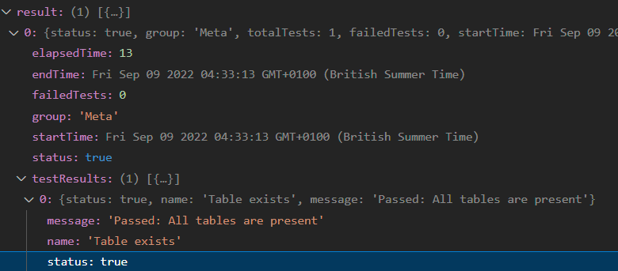

# Test-O-Matiq

> **Warning**
>
> Under development!

---

> **Note**
>
> (**coming soon**) Please check out the [Wiki section](https://github.com/Informatiqal/test-o-matiq/wiki) for details and examples

The core for data testing framework for Qlik Sense apps

## Introduction

Data testing (especially regression testing) is usually boring and time consuming job. There are different approaches for automate/semi-automate data testing.

`Test-O-Matiq` is designed to be ran against Qlik Sense app. The package will execute user defined set of tests. The tests are split in few main areas:

- Meta - test the overall status of an app
    - Data model
        - Fields - list of fields to be present in the app
        - Tables - list of tables to be present in the app
        - Synthetic keys - synthetic keys are allowed or not in the app
        - Always one selected - list of fields, for which `qOneAndOnlyOne` property should be present
    - Objects - list of objectIds (viz, sheet etc) to be present in the app
    - Fields - list of fields to exists and the count of their distinct values is matching an expected number
    - Tables - list of tables to exists and the count of their rows is matching an expected number
    - Variables
        - Exists - variables to exists in the app
        - DoNotExists - variables to not exists in the app
- Data - list of test cases. Each test case have two main sections:
    - Selections (optional) - this sections contains set of selections to be made before the tests are ran
    - Tests - the actual tests to be performed. **Tests are ran in "order of appearance"**. Three (for now) type of tests can be defined:
        - Scalar - result of "one line" expressions is compared with user defined expected result. Any Qlik expression can be specified here (ones including variables, master items, alternate states etc.). Think of this type as a "textbox" validation.
        - List - check for specific values presence in fields
        - Table - (TBA) build data table from user defined dimensions and expressions and compare the result with the expected values

## Installation

Install the package from npm

```shell
npm install --save test-o-matiq
```

> **Peer dependencies**
>
> `test-o-matiq` accepts a valid json input and an instance of a Qlik app. But the app instance should have [enigma-mixin](https://github.com/countnazgul/enigma-mixin) added

## Usage

```javascript
// NodeJS (pseudo) example
import { TestOMatiq } from "test-o-matiq";

import { docMixin } from "enigma-mixin";
import * as enigma from "enigma.js";
import * as schema from "enigma.js/schemas/12.20.0.json";
import WebSocket from "ws";

const config = {
  schema: schema,
  mixins: docMixin,
  url: "ws://localhost:4848/app/engineData",
  createSocket: (url) => new WebSocket(url),
};

const session = enigma.create(config);
const global = await session.open();
const app = await global.openDoc(`some-app-id`);

const testSuite = {
  description: "Test if table exists",
  version: "0.0.1",
  spec: {
    Meta: {
      DataModel: {
        Table: ["Table Name"],
      },
    },
  },
};

const testOMatiq = new TestOMatiq(testSuite, app);
const result = await testOMatiq.run();
```

`result` variable will have the following data:


## More examples will be available soon in the Wiki section

## Solutions

- [Test-O-Matiq CLI](https://github.com/Informatiqal/test-o-matiq-cli) - command line tool that runs test suites, from YAML files
- Test-O-Matiq Web - TBA

## Code documentation

[Dev documentation](https://informatiqal.github.io/test-o-matiq/classes/TestOMatiq.html)
